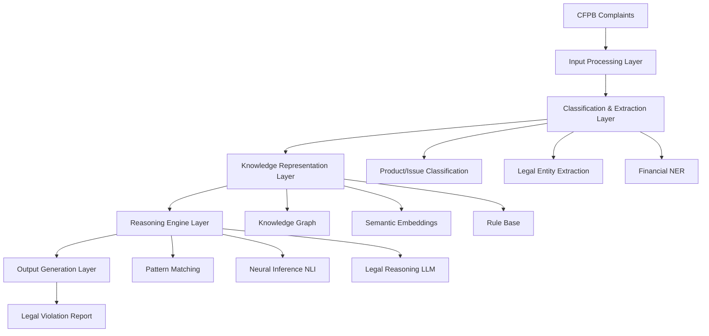

# System Architecture: NLP Legal Violation Detection

## Overview

This document defines the architecture for an automated system that analyzes Consumer Financial Protection Bureau (CFPB) complaints to identify legal violations using Natural Language Processing (NLP) approaches. The system is designed to reason "like a lawyer or regulator" by combining multiple specialized models and techniques.

## High-Level Architecture



## Component Architecture

### 1. Input Processing Layer

**Purpose**: Standardize and preprocess complaint narratives for downstream analysis.

**Components**:
- Text cleaning and normalization
- Complaint metadata extraction
- Document chunking for long narratives

**Technologies**:
- spaCy for text preprocessing
- Custom CFPB-specific text normalizers

### 2. Classification & Extraction Layer

This layer implements the multi-model pipeline approach using specialized Hugging Face models.

#### 2.1 Product/Issue Classification
- **Model**: `Mahesh9/distil-bert-finetuned-cfpb-complaints`
- **Performance**: ~95% accuracy on product type classification
- **Purpose**: Initial categorization and filtering
- **Output**: Product categories, issue types, priority scores

#### 2.2 Legal Entity Extraction
- **Model**: Legal-BERT based NER (`nlpaueb/legal-bert-base-uncased`)
- **Enhanced**: spaCy's Blackstone for legal entities
- **Purpose**: Extract key entities (banks, dates, amounts, people)
- **Output**: Structured entity graph with relationships

#### 2.3 Financial Domain NER
- **Model**: FinBERT for financial sentiment and entities
- **Purpose**: Financial harm assessment and intent analysis
- **Output**: Financial entities, harm indicators, regulatory signals

### 3. Knowledge Representation Layer

Combines traditional knowledge graphs with modern neural approaches.

#### 3.1 Knowledge Graph Construction
- **Schema**: Financial legal ontology (Consumer, Bank, Account, Violation, etc.)
- **Relations**: `violates`, `causes_harm`, `fails_to_correct`, etc.
- **Population**: Automated from NER + relation extraction models
- **Storage**: Neo4j or NetworkX for graph operations

#### 3.2 Semantic Embeddings
- **Model**: `Stern5497/sbert-legal-xlm-roberta-base`
- **Purpose**: Semantic similarity matching for legal concepts
- **Index**: FAISS or similar for fast similarity search
- **Application**: Statute retrieval and legal hook matching

#### 3.3 Rule Base
- **Format**: SPARQL queries or Python rule engine
- **Content**: Codified legal patterns (e.g., FCRA violation patterns)
- **Maintenance**: Version-controlled legal rule definitions
- **Execution**: Rule engine with explanation generation

### 4. Reasoning Engine Layer

Implements a cascade architecture for efficient and accurate violation detection.

#### 4.1 Level 1: Fast Pattern Matching
- **Speed**: ~50ms per complaint
- **Method**: Rule-based pattern matching on knowledge graph
- **Coverage**: Common, well-defined violations
- **Output**: High-confidence violations with explanations

#### 4.2 Level 2: Neural Inference (NLI)
- **Speed**: ~200ms per complaint
- **Model**: Legal-domain fine-tuned RoBERTa/DeBERTa
- **Method**: Hypothesis testing (complaint entails violation)
- **Hypotheses**: Pre-defined legal violation statements
- **Output**: Entailment scores for each potential violation

#### 4.3 Level 3: Large Language Model Reasoning
- **Speed**: ~2000ms per complaint
- **Model**: SaulLM-7B (MIT licensed, locally runnable)
- **Method**: IRAC-structured reasoning (Issue-Rule-Application-Conclusion)
- **Triggers**: Complex cases not resolved by Level 1/2
- **Output**: Detailed legal analysis with chain-of-thought

### 5. Output Generation Layer

**Components**:
- Report formatting and evidence highlighting
- Confidence scoring and uncertainty quantification
- Legal citation and statute referencing
- Audit trail generation

## Data Architecture

### Input Data Flow
```
CFPB Complaint (JSON/XML)
├── Narrative Text
├── Metadata (Product, Issue, Company)
├── Consumer Info (Demographics, Location)
└── Resolution Data (Company Response, Status)
```

### Processing Workflow
1. **Intake**: Complaint received and validated
2. **Preprocessing**: Text normalization and metadata extraction
3. **Classification**: Product/issue categorization with confidence scores
4. **Extraction**: Entity and relationship extraction
5. **Graph Construction**: Knowledge graph population
6. **Reasoning Cascade**: 
   - Level 1 pattern matching
   - Level 2 neural inference (if needed)
   - Level 3 LLM reasoning (if needed)
7. **Report Generation**: Structured violation report with evidence

### Output Data Structure
```json
{
  "complaint_id": "string",
  "violations_detected": [
    {
      "statute": "Fair Credit Reporting Act",
      "section": "15 USC 1681e(b)",
      "violation_type": "Failure to follow reasonable procedures",
      "confidence": 0.87,
      "evidence": ["text spans from complaint"],
      "reasoning_path": "IRAC-structured explanation",
      "entities_involved": ["Bank X", "Consumer Y", "Credit Bureau Z"]
    }
  ],
  "processing_metadata": {
    "processing_time": "1.2s",
    "models_used": ["level_1_rules", "legal_bert_nli"],
    "confidence_threshold": 0.75
  }
}
```

## Technology Integration

### Core Technologies
- **Python 3.9+**: Primary development language
- **Transformers Library**: Hugging Face model integration
- **PyTorch**: Deep learning framework
- **spaCy**: NLP preprocessing and NER
- **FastAPI**: REST API framework
- **PostgreSQL**: Structured data storage
- **Redis**: Caching and session management

### Model Integration
- **Hugging Face Hub**: Model downloading and caching
- **ONNX Runtime**: Optimized model inference
- **TorchServe**: Model serving for production
- **MLflow**: Model versioning and experiment tracking

### Infrastructure
- **Docker**: Containerization for consistent deployment
- **Kubernetes**: Container orchestration (for scaling)
- **Prometheus + Grafana**: Monitoring and observability
- **ELK Stack**: Logging and audit trails

## Scalability Considerations

### Computational Scaling
- **Horizontal**: Multiple worker processes for parallel complaint processing
- **Vertical**: GPU acceleration for transformer models
- **Caching**: Redis for frequent model predictions and embeddings
- **Load Balancing**: Nginx for API request distribution

### Storage Scaling
- **Knowledge Graph**: Neo4j clustering for large-scale graph operations
- **Embeddings**: Vector databases (Pinecone/Weaviate) for similarity search
- **Audit Logs**: Time-series databases for compliance tracking

### Performance Targets
- **Local Development**: 100-500 complaints/hour on single GPU workstation
- **Production**: 10,000+ complaints/hour with distributed infrastructure
- **Latency**: <3 seconds average processing time per complaint
- **Accuracy**: >85% precision on legal violation detection

## Security Architecture

### Data Protection
- **PII Handling**: Automatic detection and masking of sensitive information
- **Encryption**: AES-256 encryption for data at rest and in transit
- **Access Control**: Role-based access with audit logging
- **Compliance**: GDPR and CCPA compliance measures

### Model Security
- **Model Integrity**: Cryptographic checksums for model files
- **Input Validation**: Strict input sanitization and validation
- **Rate Limiting**: API throttling to prevent abuse
- **Monitoring**: Anomaly detection for unusual prediction patterns

## Integration Points

### External APIs
- **CFPB Data API**: Direct integration for real-time complaint processing
- **Legal Databases**: Integration with Westlaw/LexisNexis for statute lookup
- **Regulatory Updates**: Automated feeds for regulation changes

### Internal Systems
- **Case Management**: Integration with legal case tracking systems
- **Reporting Dashboard**: Real-time analytics and violation trending
- **Alert System**: Automated notifications for high-priority violations

## Monitoring and Observability

### Model Performance
- **Accuracy Metrics**: Precision, recall, F1 scores by violation type
- **Drift Detection**: Model performance degradation monitoring
- **A/B Testing**: Continuous model improvement validation

### System Health
- **Processing Metrics**: Throughput, latency, error rates
- **Resource Utilization**: CPU, memory, GPU usage tracking
- **Queue Monitoring**: Processing backlog and bottleneck identification

## Deployment Architecture

### Local Development
```
Single Machine Setup:
├── Python Environment with GPU support
├── Local PostgreSQL instance
├── Redis for caching
└── Pre-trained models downloaded locally
```

### Production Environment
```
Kubernetes Cluster:
├── API Gateway (Nginx Ingress)
├── Processing Workers (Multiple Pods)
├── Model Serving (TorchServe)
├── Database Cluster (PostgreSQL + Neo4j)
├── Monitoring Stack (Prometheus/Grafana)
└── Logging Pipeline (ELK Stack)
```

This architecture provides a robust, scalable foundation for automated legal violation detection while maintaining the explainability and reasoning capabilities required for legal applications.